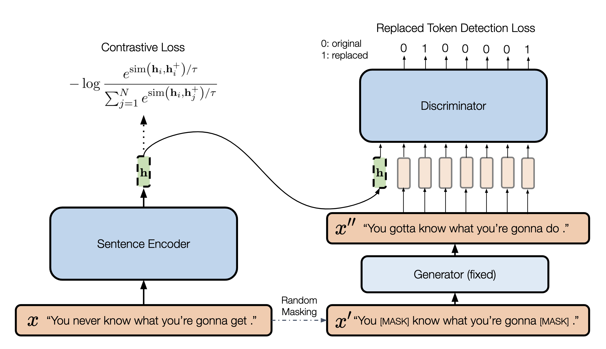

# KoDiffCSE: Korean Difference-based Contrastive Learning for Sentence Embeddings


Our code is mainly based on the code of [DiffCSE](https://arxiv.org/abs/2204.10298). Please refer to their [repository](https://github.com/voidism/DiffCSE) for more detailed infromation.


## data
### train data: kowiki + konli
### test data: kosts (from Kakao Brain)

## Training
```
bash run_diffcse.sh
```

## Evaluation
I provide a simple jupyter notebook to reproduce our results easily.
```
KoDiffCSE_eval_test.ipynb
```
In order to use sentence embedding in KoDiffCSE, you should copy and paste DiffCSE class, and enter the downloaded checkpoint of [KoDiffCSE](https://drive.google.com/drive/folders/1hUZBU42-2unZyoUOR20sytllpH1mDT9j?usp=share_link)
If you have a struggle while building KoDiffCSE, you can also access to [HuggingFace_KoDiffCSE](https://github.com/BM-K/KoDiffCSE).
More experimental results about KoDiffCSE is described in [notion](https://www.notion.so/neosapience/KoDiffCSE-Unsupervised-ver-fa336d36302545a6b485905e755e027b) and [here](https://www.notion.so/neosapience/Sentence-Embedding-9d9124786a9746f686a6d2b5862759e2).


## Overview


I made Korean version of DiffCSE using pretrained korean LMs and data.

## Setups

[](https://www.python.org/downloads/release/python-395/)
[](https://pytorch.org/get-started/previous-versions/)

### Requirements
* Python 3.9.5

### Install our customized Transformers package
```
cd transformers-4.2.1
pip install .
```
> If you have already installed `transformers==4.2.1` through pip, you need to put `modeling_bert.py` into `<your_python_env>/site-packages/transformers/models/bert/modeling_bert.py` and `modeling_roberta.py` into `<your_python_env>/site-packages/transformers/models/bert/modeling_roberta.py`.
> We modify these two files in the package so that we can perform _conditional_ pretraining tasks using BERT/RoBERTa. If possible, please directly pip install our customized Transformers package.

### Install other packages
```
pip install -r requirements.txt
```


## Citations

[](https://doi.org/10.48550/arXiv.2204.10298)

Please cite our paper and the SimCSE paper if they are helpful to your work!

```bibtex
@inproceedings{chuang2022diffcse,
   title={{DiffCSE}: Difference-based Contrastive Learning for Sentence Embeddings},
   author={Chuang, Yung-Sung and Dangovski, Rumen and Luo, Hongyin and Zhang, Yang and Chang, Shiyu and Soljacic, Marin and Li, Shang-Wen and Yih, Wen-tau and Kim, Yoon and Glass, James},
   booktitle={Annual Conference of the North American Chapter of the Association for Computational Linguistics (NAACL)},
   year={2022}
}

@inproceedings{gao2021simcse,
   title={{SimCSE}: Simple Contrastive Learning of Sentence Embeddings},
   author={Gao, Tianyu and Yao, Xingcheng and Chen, Danqi},
   booktitle={Empirical Methods in Natural Language Processing (EMNLP)},
   year={2021}
}
```
